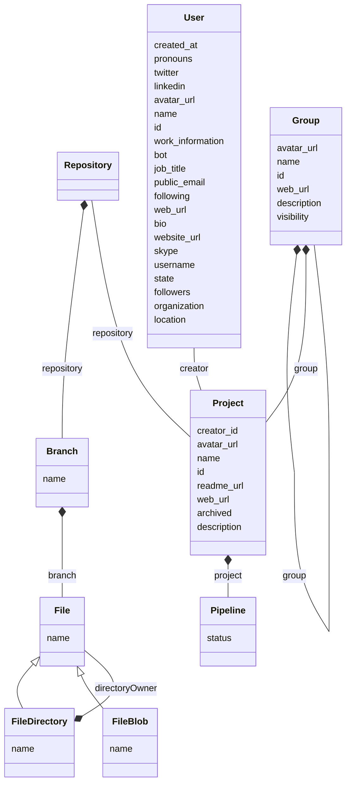

# GitProject health

This project includes a model, an importer, and some visulization to evaluate the health of a GitLab or GitHub group.

## Installation

Download a [Moose image](https://modularmoose.org/moose-wiki/Beginners/InstallMoose).

In the Moose image, in a playground (`Ctrl+O`, `Ctrl+W`), perform:

```st
Metacello new
  repository: 'github://moosetechnology/GitProjectHealth:main/src';
  baseline: 'GitLabHealth';
  onConflict: [ :ex | ex useIncoming ];
  onUpgrade: [ :ex | ex useIncoming ];
  onDowngrade: [ :ex | ex useLoaded ];
  load
```

## Usages

### Import

#### Group import: GitLab

In a playground (`Ctrl+O`, `Ctrl+W`).

```st
glhModel := GLHModel new.

glhApi := GLHApi new
    privateToken: '<Your private token>';
    baseAPIUrl:'https://gitlab.myPrivateHost.com/api/v4';
    yourself.

glhImporter := GLHModelImporter new
    glhApi: glhApi;
    glhModel: glhModel.


"137 is the ID of the a Group, you can find the number in the webpage of every project and group"
glhImporter importGroup: 137.
```

#### Group import: GitHub

In a playground (`Ctrl+O`, `Ctrl+W`).

```st
glhModel := GLHModel new.

githubImporter := GHModelImporter new glhModel: glhModel; privateToken: '<my private token>'; yourself.

githubImporter importGroup: 'moosetechnology'.
```

#### More commits extracted

> GitLab API only

You might want to gather more commits for a specific repository.
To do so in GitLab, we added the following API

```st
myProject := ((glhModel allWithType: GLHProject) select: [ :project | project name = '<my projectName>' ]) anyOne.

glhImporter importCommitsOf: myProject withStats: true until: '2023-01-01' asDate.
```

### Visualize

To visualize the group "health"

```st
dritGroup := (glhModel allWithType: GLHGroup) detect: [ :group | group id = 137 ].
canvas := (GLHGroupVisualization new forGroup: dritGroup).
canvas open.
```

### Export

To export the visualization as a svg image

```st
dritGroup := (glhModel allWithType: GLHGroup) detect: [ :group | group id = 137 ].
canvas := (GLHGroupVisualization new forGroup: dritGroup).
canvas open.

canvas svgExporter
  withoutFixedShapes;
  fileName: 'drit-group-health';
  export.
```

## Metamodel

Here is the metamodel used in this project



## Contributor

This work has been first developed by the [research department of Berger-Levrault](https://www.research-bl.com/)
